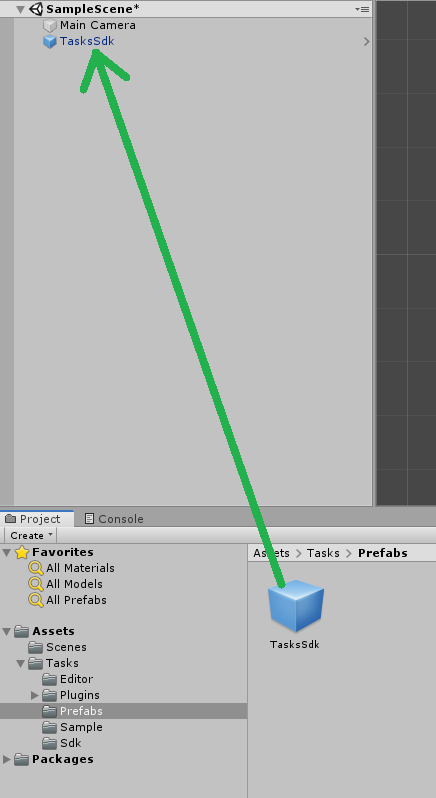

## TasksSDK Version

This project uses version v0.1.0-unity of the TasksSDK <br>
https://github.com/quality-match/tasks-sdk/releases/tag/v0.1.0-unity

The Files that need to be added into assets are in the `unitypackage` file

## Step by Step Integration Guide

1. Have a Unity Project ;-)
1. Download the `unitypackage` file from the TasksSDK Release page

    - this demo uses release [v0.1.0-unity](https://github.com/quality-match/tasks-sdk/releases/tag/v0.1.0-unity)

    In case access to the file is restricted, contact us to send it to you

1. Drop the `unitypackage` into your project's Unity Editor and import everything
1. In the Unity Editor:

    1. Drag the Prefab `Assets/Tasks/Prefabs/TasksSdk` into a Scene <br> 
    1. Open the Inspector of the TasksSdk Prefab and update the settings to match these:
        - set `Base Url` to https://test-ui.devtest.quality-match.com
            - this url can be used for testing
        - leave `Client Id` and `Client Secret` empty
        - these settings and values are subject to change over time
    1. The warnings from `Assets/Tasks/Sdk/Sdk.cs`, that refer to `TaskResult` and `TaskReward` parameters that are never assigned, can be ignored
    1. This is an example function for triggering the TasksSDK webview and handling the returned result.

        ```csharp
        public class ViewModel : MonoBehaviour
        {
            public void Load_Task_UI()
            {
                QualityMatch.Tasks.Sdk.ShowTask((status, result) => {
                    Debug.Log(string.Format("OnTaskCompleted: [{0}] {1}",
                        status, JsonUtility.ToJson(result)));
                });
            }
        }
        ```

        Calling the function `QualityMatch.Tasks.Sdk.ShowTask` triggers the webview. The function needs a callback `TaskCompletedDelegate` that will be called when the webview is closed.<br>
        Either on `Success`, meaning that the user has successfully submitted all answers to our server<br>
        or on `Cancelled`, meaning that the user has closed the webview manually by clicking the X in the top right corner.

        The file `AssetsTasks/Sdk/Sdk.cs` contains the relevant signatures for ShowTask, TaskCompletedDelegate, TaskCompletedStatus, TaskResult and TaskReward

        ```csharp
        public static void ShowTask(TaskCompletedDelegate onTaskCompleted)
        ```

        ```csharp
        public delegate void TaskCompletedDelegate(TaskCompletedStatus status, TaskResult result);
        ```

1. Build, Run and have fun
    - Note: the minimum Android API level is 21 (Android 5.0)
